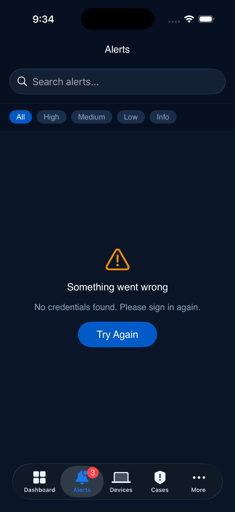
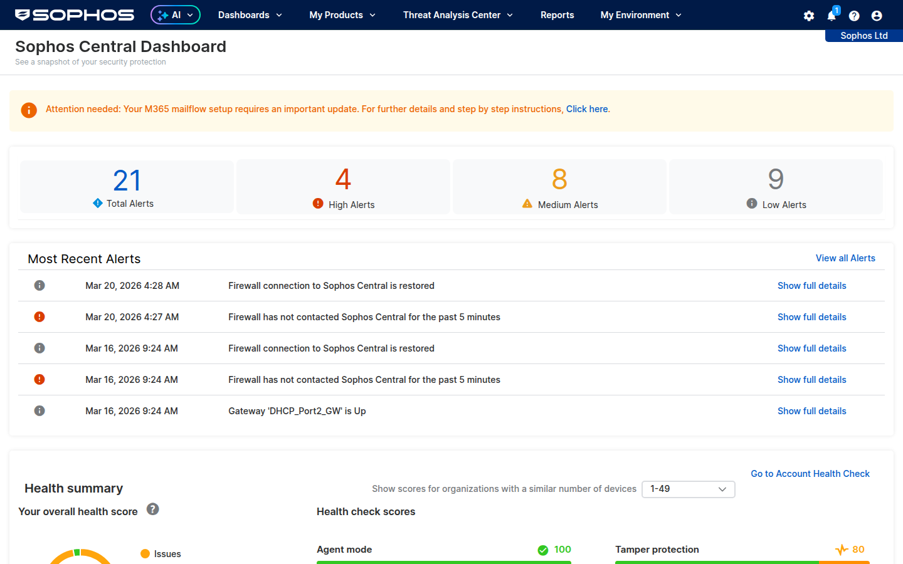

# Sophos Central Mobile App

A native iOS companion app for **Sophos Central** — giving security engineers and administrators full visibility and control of their Sophos environment from their phone. Built with SwiftUI, backed by the Sophos Central API, a Playwright browser automation backend, and an AI-powered security assistant.

  

---

## Table of Contents

- [What Changed](#what-changed)
- [Features](#features)
- [Architecture](#architecture)
- [Screenshots](#screenshots)
- [Getting Started](#getting-started)
- [Playwright Backend Deployment](#playwright-backend-deployment)
- [AI Assistant Setup](#ai-assistant-setup)
- [API Coverage](#api-coverage)
- [Current Limitations](#current-limitations)
- [Future Roadmap](#future-roadmap)

---

## What Changed

### Before (`main` branch)

The original app was an API-only iOS client for Sophos Central with:

- **Dashboard** — account health score, alert summary cards, device overview
- **Alerts** — list, filter by severity, acknowledge, view detail
- **Devices** — list endpoints, view detail, isolate/de-isolate, trigger scans
- **Cases** — list and view case details
- **Settings** — connection info, notification preferences, sign out
- **Auth** — OAuth client credentials flow against Sophos Central API
- **Offline cache** — SwiftData persistence for alerts, endpoints, cases, health
- **Push notifications** — basic local notifications for high-severity alerts

This gave roughly **40% coverage** of what Sophos Central can do — limited to what the REST API exposes.

### After (`acosta-branch`)

The branch adds **12 major features** that transform the app from a basic API viewer into a full mobile command center:

| Category | Feature | Description |
|----------|---------|-------------|
| 🤖 AI | **AI Security Assistant** | Groq-powered chat (llama-3.3-70b) with full environment context. Triage alerts, investigate incidents, get remediation guidance — all in natural language. |
| 🎭 Automation | **Playwright Backend** | Headless browser automation for Sophos Central features the API can't reach. Dockerized, cross-platform. |
| 🔍 Investigation | **Live Discover** | Run SQL-like queries across all endpoints. 8 pre-built templates (processes, network, files, services, etc.) with a custom query editor. |
| 🛡️ Threat Intel | **IOC Enrichment** | Look up hashes, IPs, and domains against VirusTotal and AbuseIPDB. Auto-detects IOC type. |
| 👁️ Tracking | **Watchlist** | Flag any endpoint, alert, or case for tracking. Filter by type, swipe to remove. |
| 🔔 Notifications | **Smart Notifications** | Background polling with AI-generated triage summaries. Quick actions: Acknowledge, View, Isolate — right from the notification. |
| 📱 Widgets | **iOS Home Screen Widgets** | Small (health score ring) and medium (full stats) widgets. Glanceable security status without opening the app. |
| 🗣️ Siri | **Siri Shortcuts** | "Hey Siri, check my Sophos health score" — 3 intents for health, alerts, and device status. |
| 🏢 Multi-Tenant | **Tenant Management** | Manage multiple Sophos Central organizations. Switch between tenants with one tap. |
| 🔧 Config | **Exclusions Management** | List, add, and delete scanning exclusions (path, process, web, PUA, behavioral, AMSI). |
| 🔥 Config | **Firewall Monitoring** | View linked Sophos Firewalls with online/offline status. |
| 🎮 Demo | **Demo Mode** | Realistic fake data (ransomware scenario, 10 endpoints, cases) for customer demos. No tenant needed. |

### Why This Matters

**For SEs:** Demo the app to customers without connecting to a real tenant. Use the AI assistant during customer meetings to answer security questions in real-time. Monitor multiple customer environments from one app.

**For Admins:** Respond to incidents from anywhere. Get AI-triaged notifications that tell you what's happening, not just that something happened. Run Live Discover queries from your phone. Look up IOCs instantly.

**For SOC Teams:** Mobile triage capability. Watchlist critical items for follow-up. Natural language investigation — "What happened on PACS-IMAGING-1 in the last hour?"

---

## Features

### AI Security Assistant

The AI tab provides a conversational security analyst powered by Groq's `llama-3.3-70b-versatile`. It automatically loads your current environment context (alerts, devices, health, cases) and provides:

- **Alert triage** — "What needs immediate attention?"
- **Risk assessment** — severity ratings with specific recommendations
- **Attack narratives** — "Here's what happened: initial access via phishing, lateral movement to 3 servers..."
- **Remediation guidance** — "Isolate WORKSTATION-04, check this policy gap"
- **Natural language queries** — "Show me all unprotected endpoints"

Quick action buttons provide one-tap access to common analyses.

### Playwright Backend

A headless Chrome instance that authenticates to Sophos Central's web console, enabling access to features the API doesn't expose:

- **Live Discover** — SQL queries across all managed endpoints
- **Threat Graphs** — visual attack chain data
- **Policy Details** — full policy configuration (not just assignment)
- **Screenshots** — capture any Sophos Central page for reference
- **Health Check Detail** — granular health scores beyond the API

Deployed as a Docker container with built-in noVNC for the initial 2FA login. See [Playwright Backend Deployment](#playwright-backend-deployment).

### Smart Notifications

Goes beyond basic "new alert" notifications:

1. Polls for new high-severity alerts every 60 seconds
2. Sends the alert through the AI assistant for triage
3. Delivers a notification with the AI's assessment, not just the raw alert text
4. Quick actions let you **Acknowledge**, **View Details**, or **Isolate the Endpoint** directly from the notification

### iOS Widgets

Two widget sizes for the home screen:

- **Small** — health score ring + alert count
- **Medium** — health score + alert breakdown + device count + issues

Data is pushed to shared UserDefaults on every dashboard refresh.

### Multi-Tenant

SEs managing multiple customer environments can:

- Add unlimited tenants with API credentials
- Switch between tenants with one tap
- See last-known health score and alert count per tenant
- Credentials stored encrypted in SwiftData

---

## Architecture

```
┌─────────────────────────────────────────────────────────┐
│                    iOS App (SwiftUI)                     │
│                                                         │
│  ┌──────────┐ ┌──────────┐ ┌──────────┐ ┌───────────┐  │
│  │Dashboard │ │  Alerts  │ │ Devices  │ │   Cases   │  │
│  └────┬─────┘ └────┬─────┘ └────┬─────┘ └─────┬─────┘  │
│       │             │            │              │        │
│  ┌────┴─────────────┴────────────┴──────────────┴────┐  │
│  │              SophosAPIService (actor)              │  │
│  └───────────────────────┬───────────────────────────┘  │
│                          │                               │
│  ┌──────────┐ ┌──────────┴──┐ ┌───────────┐            │
│  │AI Agent  │ │ Playwright  │ │Threat     │            │
│  │(Groq)    │ │ Service     │ │Intel (VT) │            │
│  └────┬─────┘ └──────┬──────┘ └─────┬─────┘            │
│       │               │              │                   │
│  ┌────┴───┐    ┌──────┴──────┐  ┌───┴────┐             │
│  │Keychain│    │  SwiftData  │  │Widgets │             │
│  │Service │    │   (Cache)   │  │(Shared)│             │
│  └────────┘    └─────────────┘  └────────┘             │
└──────────┬──────────────┬──────────────┬────────────────┘
           │              │              │
     ┌─────▼─────┐ ┌─────▼──────┐ ┌────▼──────┐
     │  Sophos   │ │ Playwright │ │   Groq    │
     │ Central   │ │  Backend   │ │   API     │
     │   API     │ │  (Docker)  │ │           │
     └───────────┘ └─────┬──────┘ └───────────┘
                         │
                   ┌─────▼──────┐
                   │  Sophos    │
                   │ Central    │
                   │ Web UI     │
                   └────────────┘
```

### Key Design Decisions

- **Actor-based services** — `SophosAPIService`, `PlaywrightService`, `AIAgentService`, `ThreatIntelService` are all Swift actors for thread-safe concurrent access
- **MVVM** — ViewModels handle business logic, Views are purely declarative
- **SwiftData** — offline-first caching for alerts, endpoints, cases, health, watchlist, tenants
- **Keychain** — all credentials and API keys stored in iOS Keychain (never in UserDefaults or plain text)
- **XcodeGen** — `project.yml` generates the Xcode project, keeping the `.xcodeproj` clean and mergeable

### File Structure

```
CentralMobileApp/
├── App/
│   ├── CentralMobileAppApp.swift    # Entry point, model container
│   └── AppDelegate.swift            # Push notifications, background fetch
├── Models/
│   ├── APIModels.swift              # All Sophos Central API response types (~550 lines)
│   ├── CacheModels.swift            # SwiftData offline cache models
│   ├── WatchlistModels.swift        # Watchlist SwiftData model
│   └── TenantModels.swift           # Multi-tenant SwiftData model
├── Services/
│   ├── SophosAPIService.swift       # Sophos Central REST API client
│   ├── AuthService.swift            # OAuth token management
│   ├── KeychainService.swift        # Secure credential storage
│   ├── PlaywrightService.swift      # Playwright backend client
│   ├── AIAgentService.swift         # Groq LLM integration
│   ├── ThreatIntelService.swift     # VirusTotal + AbuseIPDB
│   ├── SmartNotificationService.swift # AI-triaged alert notifications
│   ├── DemoDataService.swift        # Fake data for demo mode
│   └── PushNotificationService.swift # APNs registration
├── ViewModels/
│   ├── DashboardViewModel.swift     # Dashboard data + widget sync
│   ├── AuthViewModel.swift          # Login flow
│   └── DevicesViewModel.swift       # Device list management
├── Views/
│   ├── Dashboard/                   # 5 dashboard card views
│   ├── Alerts/                      # Alert list + detail
│   ├── Devices/                     # Device list + detail
│   ├── Cases/                       # Case list + detail
│   ├── Agent/                       # AI chat view
│   ├── Playwright/                  # Live Discover, policies, screenshots, status
│   ├── Watchlist/                   # Watchlist view
│   ├── ThreatIntel/                 # IOC lookup view
│   ├── Exclusions/                  # Exclusion management
│   ├── Firewall/                    # Firewall monitoring
│   ├── Tenants/                     # Multi-tenant management
│   ├── Settings/                    # Settings + AI config
│   └── Auth/                        # Login screen
├── Intents/
│   └── SophosIntents.swift          # Siri shortcuts (3 intents)
├── Theme/
│   └── SophosTheme.swift            # Full Sophos brand design system
└── Resources/
    ├── Assets.xcassets/             # App icon, colors
    └── Info.plist

playwright-backend/                   # Dockerized Playwright backend
├── Dockerfile
├── docker-compose.yml
├── entrypoint.sh
├── server.mjs                       # Express API server
├── login.mjs                        # Interactive login with noVNC
├── package.json
└── README.md

SophosWidget/                         # iOS widget extension
└── SophosWidget.swift               # Small + medium widget views
```

---

## Screenshots

### Mobile App — Dashboard (Demo Mode)

<p align="center">
  
</p>

The dashboard shows account health score (88/100), protection and tamper protection issues, alert severity breakdown (3 critical, 2 warning, 1 other), and recent high-severity alerts including ransomware and PowerShell detections. The tab bar provides quick access to Alerts, Devices, Cases, and the AI Assistant (under More).

### Sophos Central Web Console (via Playwright)

<p align="center">
  
</p>

The Playwright backend captures the full Sophos Central web console. This screenshot shows the live dashboard with 21 total alerts, health summary scores, and recent firewall connectivity events — data that supplements the API and powers features like Live Discover and threat graph analysis.

---

## Getting Started

### Prerequisites

- **Xcode 16+** with iOS 26 SDK
- **XcodeGen** — `brew install xcodegen`
- A **Sophos Central** account with API credentials (Client ID + Client Secret)
- Optional: **Groq API key** for the AI assistant ([console.groq.com](https://console.groq.com))
- Optional: **Docker** for the Playwright backend

### Build & Run

```bash
# Clone and switch to the feature branch
git clone git@github.com:madmatdev/Sophos-Central-Mobile-App.git
cd Sophos-Central-Mobile-App
git checkout acosta-branch

# Generate the Xcode project
xcodegen generate

# Open in Xcode
open CentralMobileApp.xcodeproj

# Select iPhone simulator → ⌘R to build and run
```

### Demo Mode (No Credentials Needed)

Tap **"Enter Demo Mode"** on the login screen. The app loads with realistic fake data:

- 6 alerts (ransomware, PowerShell, CryptoGuard, firewall, outdated definitions, PUA)
- 10 endpoints (mix of healthy, suspicious, and compromised)
- 3 cases (active investigation, new case, PUA cleanup)
- Account health score of 88/100 with protection and tamper issues

---

## Playwright Backend Deployment

The Playwright backend runs as a Docker container on any Mac, Windows, or Linux machine. It provides browser automation for Sophos Central features the API can't access.

### Quick Start

```bash
cd playwright-backend

# Build and start
docker compose up -d

# First run — complete the 2FA login:
# 1. Open http://localhost:6080 in your browser
# 2. You'll see a Chrome window with the Sophos Central login
# 3. Log in with your credentials + MS Authenticator
# 4. Once you see the dashboard, attach and press Enter:
docker attach sophos-playwright
# Press Enter → session saves → Ctrl+P Ctrl+Q to detach
```

### Re-Login (when session expires)

```bash
docker compose exec sophos-playwright node login.mjs
# Use noVNC at http://localhost:6080 to complete 2FA
# Press Enter when done
```

### Connect the App

In the iOS app: **Settings → Advanced → Backend Status**

The app defaults to `http://grimstarr.tail3ddb09.ts.net:18870`. Update in Settings if running elsewhere.

---

## AI Assistant Setup

1. Get a Groq API key at [console.groq.com](https://console.groq.com)
2. In the app: **Settings → Advanced → AI Configuration**
3. Paste your API key and tap Save
4. Navigate to the **AI** tab and start asking questions

The assistant automatically loads your current environment data (alerts, devices, health scores, cases) as context for every conversation.

### Example Prompts

- "What needs immediate attention?"
- "Summarize the ransomware alert for an executive"
- "Why is PACS-IMAGING-1 in bad health?"
- "Write a Live Discover query to find all running PowerShell processes"
- "What's my risk exposure this week vs last week?"

---

## API Coverage

### Sophos Central REST API (Direct)

| Endpoint | Operations | Status |
|----------|-----------|--------|
| Account Health | Read | ✅ |
| Alerts | List, Detail, Acknowledge | ✅ |
| Endpoints | List, Detail, Full view | ✅ |
| Isolation | Isolate, De-isolate, Status | ✅ |
| Scans | Trigger scan | ✅ |
| Cases | List, Detail | ✅ |
| Tamper Protection | Read, Enable/Disable | ✅ |
| Exclusions | List, Create, Delete | ✅ |
| Firewalls | List | ✅ |
| Firewall Groups | List | ✅ |

### Playwright Backend (Browser Automation)

| Feature | Status |
|---------|--------|
| Live Discover queries | ✅ Built (selectors may need tuning per tenant) |
| Screenshots of any page | ✅ Working |
| Health check detail | ✅ Working |
| Threat graphs | ✅ Built (SPA routing refinement needed) |
| Policy details | 🔲 Planned |
| Email gateway | 🔲 Planned |
| XDR Data Lake | 🔲 Planned |

---

## Current Limitations

### What the App Cannot Do Yet

| Limitation | Reason | Workaround |
|------------|--------|------------|
| **Edit endpoint policies** | API doesn't support it, Playwright selectors not yet mapped | Use web console |
| **Email gateway management** | Not in API, Playwright endpoint not built | Use web console |
| **XDR Data Lake queries** | API doesn't support it | Planned via Playwright |
| **Live Response terminal** | Requires persistent WebSocket, complex on mobile | Use web console |
| **User/group management** | API coverage limited | Use web console |
| **Report generation** | API doesn't support it | Planned via Playwright screenshots |
| **Real-time streaming** | Polling every 60s, not WebSocket | Sufficient for mobile |
| **Push notifications (remote)** | Uses local polling, not server-side APNs | Works but requires app to run |

### Playwright Caveats

- **2FA required** — initial login must be done manually via noVNC
- **Session expiry** — sessions last hours/days but will eventually expire, requiring re-login
- **SPA routing** — Sophos Central uses client-side routing; some pages need direct navigation tuning
- **Selectors** — DOM selectors may vary between Sophos Central versions/tenants

### Platform

- **iOS only** — no Android version (would require full rewrite in Kotlin/Compose)
- **TestFlight required** — not on App Store (enterprise/internal distribution)
- **iOS 18+ required** — uses SwiftData, App Intents, modern SwiftUI features

---

## Future Roadmap

### Near-Term

- [ ] **TestFlight distribution** — internal beta for SE team
- [ ] **Real tenant testing** — validate all API calls against production Sophos Central
- [ ] **Live Discover selector refinement** — map exact DOM selectors for Sophos Central's SPA
- [ ] **Session expiry alerting** — Magnus Telegram notification when Playwright session expires
- [ ] **Widget extension build** — separate Xcode target for the widget

### Mid-Term

- [ ] **Offline mode improvements** — deeper SwiftData caching, full offline alert/device browsing
- [ ] **Handoff to web** — deep-link from any item to the exact Sophos Central web page
- [ ] **iPad layout** — multi-column layout for larger screens
- [ ] **Email gateway** — quarantine management, sender allow/block lists via Playwright
- [ ] **XDR Data Lake** — cross-product query support via Playwright
- [ ] **Policy editor** — view and modify endpoint protection policies
- [ ] **Report snapshots** — scheduled Playwright screenshots of executive dashboards
- [ ] **Threat intel auto-enrichment** — automatically look up IOCs from alert details

### Long-Term

- [ ] **Apple Watch companion** — glanceable health score + alert count on wrist
- [ ] **Server-side push** — backend APNs service for true real-time alert notifications
- [ ] **Multi-user / RBAC** — role-based access for SOC teams sharing the app
- [ ] **Sophos Partner Portal integration** — MSP multi-tenant view across all customers
- [ ] **Android version** — Kotlin Multiplatform or separate native app
- [ ] **App Store distribution** — public release for Sophos customers

---

## Contributing

This project is on the `acosta-branch`. To contribute:

1. Create a feature branch from `acosta-branch`
2. Make your changes
3. Ensure `xcodegen generate` produces a clean project
4. Build succeeds: `xcodebuild -scheme CentralMobileApp -destination 'platform=iOS Simulator,name=iPhone 17 Pro'`
5. Open a PR against `acosta-branch`

### Development Setup

```bash
# Required tools
brew install xcodegen

# Generate project after adding/removing files
xcodegen generate

# Build from command line
xcodebuild -scheme CentralMobileApp \
  -destination 'platform=iOS Simulator,name=iPhone 17 Pro,OS=26.4' \
  build
```

---

## License

Internal project — not for public distribution.

---

*Built with SwiftUI, Sophos Central API, Playwright, and Groq AI.*
